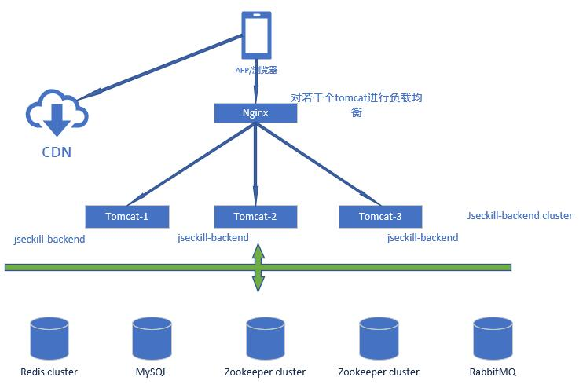

# jseckill


<br/>

| 📘 | 🛫 | 🐱 | 🏛 | 🛒 | 🚀 | 💡 | 🔨 | 💌 |
| :--------: | :---------: | :------: | :------: | :------: | :------: | :------: | :------: | :------: |
| [介绍](#介绍) | [演示](#演示) | [技术栈](#技术栈) | [架构图](#架构图) | [秒杀过程](#秒杀过程) | [Quick Start](#QuickStart) | [源码解析](#源码解析) | [做贡献](#做贡献) | [联系作者](#联系作者) |

## 介绍

<code>jseckill</code>:Java实现的秒杀网站，基于Spring Boot 2.X。 

<code>jseckill</code>:Seckill website implemented with Java, based on Spring Boot 2.X.


## 演示
**点击进入演示**：[http://jseckill.appjishu.com](http://jseckill.appjishu.com)

注意：提升输入手机号时，随便输入一个11位的数字即可，**不需要填自己的真实手机号**

效果图

  &nbsp;&nbsp;  
<br/>
<br/>


## 技术栈
- Spring Boot 2.X
- MyBatis
- Redis, MySQL
- Thymeleaf + Bootstrap
- RabbitMQ
- Zookeeper, Apache Curator


## 架构图
部署图
(zookeeper暂时没有用上, 忽略之)
<br/><br/>

<br/>
<br/>

## 秒杀过程
秒杀进行的过程包含两步骤：
步骤一（秒杀）：在Redis里进行秒杀。 这个步骤用户并发量非常大，抢到后，给与30分钟的时间等待用户付款， 如果用户过期未付款，则Redis库存加1
，算用户自动放弃付款。

步骤二（付款）：用户付款成功后，后台把付款记录持久化到MySQL中，这个步骤并发量相对小一点，使用数据库的事务解决数据一致性问题

下面重点讲步骤一，**秒杀**过程

秒杀步骤流程图


1.流程图Step1：先经过Nginx负载均衡和分流

2.进入jseckill程序处理。 Google guava RateLimiter限流。 并发量大的时候，直接舍弃掉部分用户的请求

3.Redis判断是否秒杀过。避免重复秒杀。如果没有秒杀过 <br/>
把用户名（这里是手机号）和seckillId封装成一条消息发送到RabbitMQ，请求变成被顺序串行处理 <br/>
立即返回状态“排队中”到客户端上，客户端上回显示“排队中...” 

4.后台监听RabbitMQ里消息，每次取一条消息，并解析后，请求Redis做库存减1操作（decr命令） <br/>
并手动ACK队列 
如果减库存成功，则在Redis里记录下库存成功的用户手机号userPhone.

5.流程图Step2：客户端排队成功后，定时请求后台查询是否秒杀成功，后面会去查询Redis是否秒杀成功<br/>
如果抢购成功，或者抢购失败则停止定时查询， 如果是排队中，则继续定时查询。

详情见源码文档


## QuickStart
- clone源码

<code>git clone https://github.com/liushaoming/jseckill.git </code>

- 在Intelij IDEA/eclipse里导入根路径下的pom.xml，再导入文件夹jseckill-backend下面的pom.xml, 等待maven依赖下载完毕

- 修改application.properties里面的自己的Redis,MySQL,Zookeeper,RabbitMQ的连接配置

- 右键JseckillBackendApp.java--run as--Java Application

开始Debug

## 源码解析    
👉 [进入源码解析](SOURCE-README.md)
### Java后端限流
使用Google guava的RateLimiter来进行限流 <br/>
例如：每秒钟只允许10个人进入秒杀步骤. (可能是拦截掉90%的用户请求，拦截后直接返回"很遗憾，没抢到") <br/>
AccessLimitServiceImpl.java代码 <br/>
```java
package com.liushaoming.jseckill.backend.service.impl;

import com.google.common.util.concurrent.RateLimiter;
import com.liushaoming.jseckill.backend.service.AccessLimitService;
import org.springframework.stereotype.Service;

/**
 * 秒杀前的限流.
 * 使用了Google guava的RateLimiter
 */
@Service
public class AccessLimitServiceImpl implements AccessLimitService {
    /**
     * 每秒钟只发出10个令牌，拿到令牌的请求才可以进入秒杀过程
     */
    private RateLimiter seckillRateLimiter = RateLimiter.create(10);

    /**
     * 尝试获取令牌
     * @return
     */
    @Override
    public boolean tryAcquireSeckill() {
        return seckillRateLimiter.tryAcquire();
    }
}
```       
👉 [查看更多源码解析](SOURCE-README.md)


## 做贡献

### TODO list
jseckill启动的时候，需要把已经付款了的秒杀记录（数据表success_seckilled）同步到 <br/>
已秒杀的Redis数据中去。

欢迎提交代码发送<code>Pull Requests</code>, 有代码改进优化的建议的统一在Issues里面提。

喜欢本项目的，**请在GitHub右上角点**[star](https://github.com/liushaoming/jseckill/stargazers)


## 联系作者
|  联系方式 |  |
| :-------- | :-------- |
| 开发者 | liushaoming |
| email | [liushaomingdev@163.com](mailto:liushaomingdev@163.com) |
| QQ | 944147540 |


加QQ群讨论 
<br/>


微信公众号


